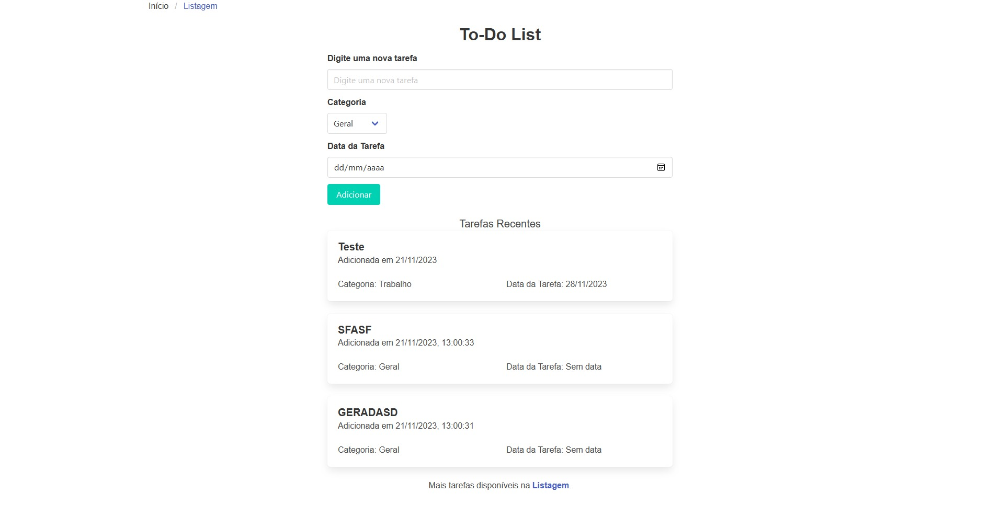
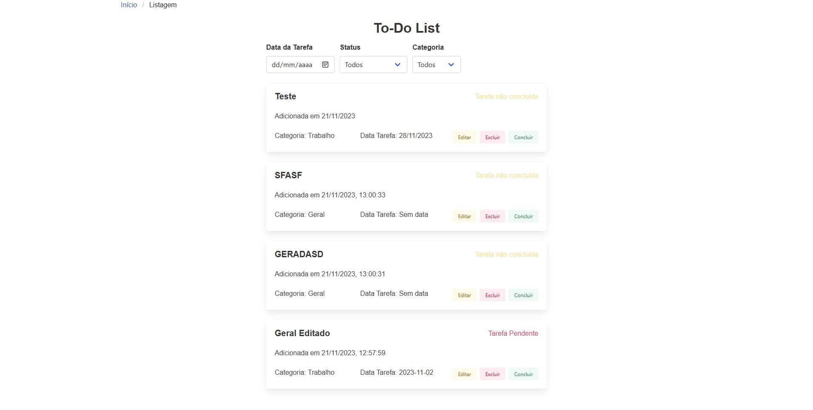

# Projeto To-Do List 📝

## Descrição 📄
Este é um simples aplicativo To-Do List desenvolvido em React. Ele permite aos usuários criar, editar, excluir e visualizar tarefas, armazenando os dados localmente no navegador.

## Capturas de Tela 📸
<!-- Adicione suas capturas de tela aqui -->

### Tela Inicial
  

### Tela de Listagem
 

## Tecnologias Utilizadas 🛠️
 
 
 

## Como Executar o Projeto ▶️
1. Clone o repositório: `git clone https://github.com/LucSena/To-Do-List.git`
2. Navegue até o diretório do projeto: `cd To-Do-List`
3. Instale as dependências: `npm install`
4. Inicie o aplicativo: `npm start`
5. Abra o navegador e acesse `http://localhost:3000`

## Funcionalidades ⚙️
- Adicionar tarefas com título, categoria e data
- Editar tarefas existentes
- Excluir tarefas
- Marcar tarefas como concluídas
- Filtrar tarefas por data, status e categoria

## Contribuindo 🤝
Contribuições são bem-vindas! Sinta-se à vontade para abrir uma issue ou enviar um pull request.

## Licença 📜
Este projeto está licenciado sob a [Licença MIT](LICENSE).
